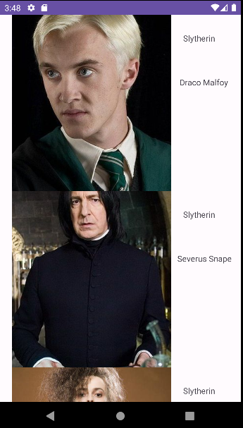
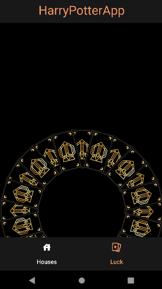

# Harry Potter app in Android Studio with Kotlin
## Depending on the house you choose, it will give you the characters that belong to it.

* [Retrofit](https://github.com/square/retrofit)
* [HarryAPI](https://hp-api.onrender.com/)

### En esta app se encuentra:
   
- MVVM architecture and clean code
- Fragments
- Navigation Component
- Gradle KTS
- Dependency injection
- StateFlow and coroutines
- RecyclerView
- Retrofit, interceptors and mappers
- Intents
- Animations

Once the house has been chosen, it will take us to its respective list:

We also have another fragment of luck:

