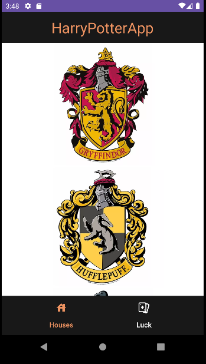

# Harry Potter app in Android Studio with Kotlin

## Depending on the house you choose, it will give you the characters that belong to it.

* [Retrofit](https://github.com/square/retrofit)
* [HarryAPI](https://hp-api.onrender.com/)
* [Dagger Hilt](https://developer.android.com/training/dependency-injection/hilt-android?hl=es-419)
* [MVVM](https://inmediatum.com/blog/ingenieria/mvvm-que-es-y-como-funciona/#:~:text=MVVM%2C%20por%20sus%20siglas%20en,parte%20visual%20sea%20totalmente%20independiente.)

### In this application you will find:

- MVVM architecture and clean code
- Fragments
- Navigation Component
- Gradle KTS
- Dependency injection
- StateFlow and coroutines
- RecyclerView
- Retrofit
- Intents
- Animations

### On the main screen we have the shield of the different houses through a recycler view.

### By clicking on them we will have an animation that will lead to the next activity, which is a list of the characters belonging to that house. In this case, Slythering

### We also have another fragment of luck:

### When you press the roulette wheel it will spin and give us a random card

